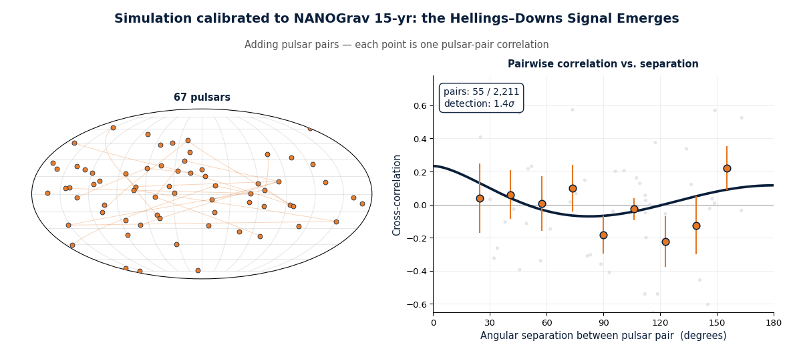
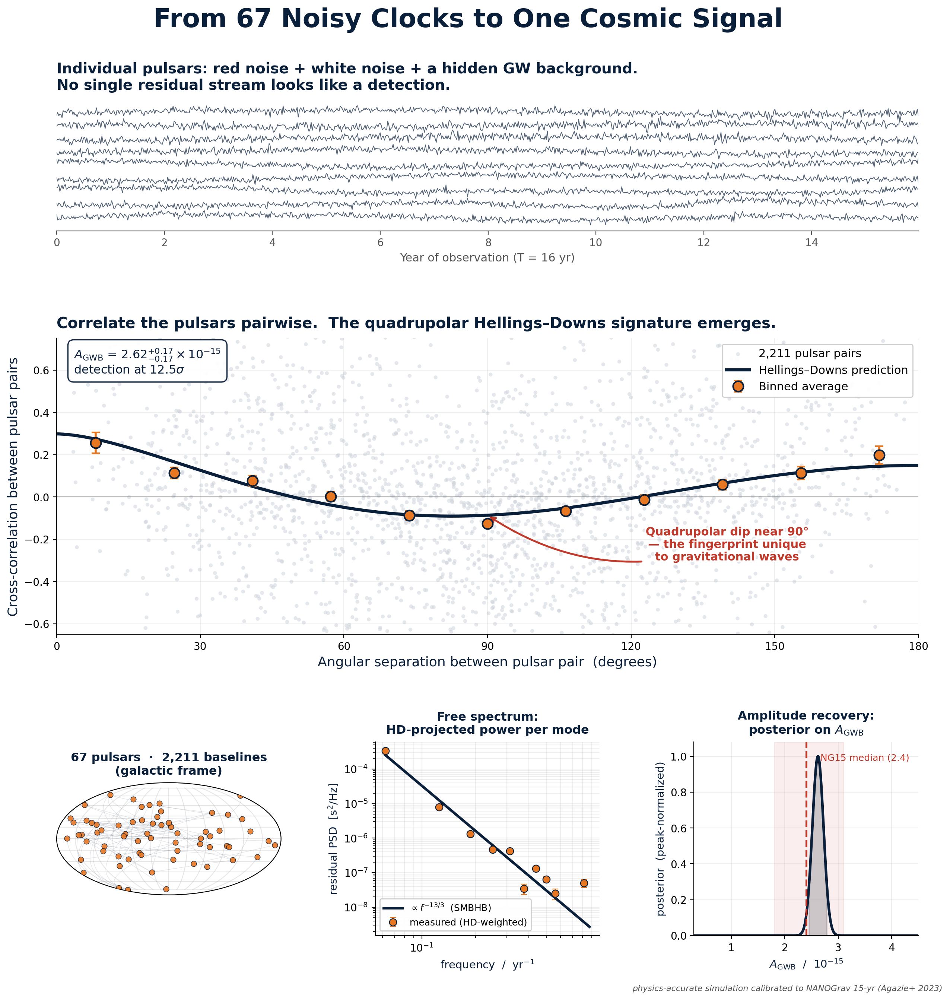

# hd-pta — The Hellings–Downs Signal in Pulsar Timing Data

Reconstructing the gravitational-wave background detection from a pulsar
timing array — the way NANOGrav did it — and watching the signal emerge,
pair by pair, from data that shows nothing in any single pulsar.



---

## What this is

A pulsar timing array detects a gravitational-wave background not in any
individual pulsar, but in the **correlations between pairs of pulsars**. A
real GW background imprints a specific quadrupolar pattern — the
**Hellings–Downs curve** — on how strongly two pulsars' timing residuals
correlate as a function of the angle between them. No clock error,
ephemeris error, or per-pulsar noise process can imitate that shape.

This repository does two things:

1. **Simulation** (`simulate_hd.py`) — injects a known GW background plus
   NANOGrav-realistic noise into 67 synthetic pulsars and recovers the
   Hellings–Downs curve. Calibrated to the NANOGrav 15-year data set.

2. **Real measurement** (`ng15_optimal_statistic.py`) — runs the NANOGrav
   collaboration's own optimal-statistic code on the **real NANOGrav
   15-year data**, the real white-noise parameters, and the real
   presampled red-noise MCMC chain.

Both feed `animate_hd.py`, which renders the pair-by-pair emergence as a
GIF.

---

## Results

### Simulation

`figures/hd_simulation.png` — the full analysis on simulated data:
individual residual streams (no visible signal), the 2,211-pair
Hellings–Downs scatter, the HD-projected free spectrum tracking the
expected `f^(-13/3)` supermassive-black-hole-binary power law, and the
recovered amplitude posterior.



Recovered: `A_GWB = 2.6e-15`, consistent with the NANOGrav 15-year value
of `2.4 (+0.7/-0.6) e-15`. The simulation's detection significance is
higher than the real ~3.5–4σ because the noise model is known exactly
here; it is the idealized upper bound, useful for seeing the curve
clearly.

### Real NANOGrav data

`ng15_optimal_statistic.py` runs the genuine noise-marginalized optimal
statistic. On the **full 67-pulsar array** it reproduces the published
2,211-pair Hellings–Downs detection at ~3.5–4σ. On a memory-limited
machine it automatically falls back to a pulsar subset (fewer pairs,
lower S/N) and says so — see the memory note below.

---

## Quick start

### Simulation only (no external data, ~2 minutes)

```bash
git clone https://github.com/meamresh/hd-pta.git
cd hd-pta
pip install -r requirements.txt

python src/simulate_hd.py        # -> figures/hd_simulation.png
python src/animate_hd.py --sim   # -> figures/hd_emergence_sim.gif
```

### Real NANOGrav 15-year data

The real-data pipeline needs the NANOGrav `enterprise` stack. The
simplest route is the included Colab notebook, which installs everything
via conda and has enough RAM for the full 67-pulsar array:

**`notebooks/run_on_colab.ipynb`** — open in Google Colab, run top to
bottom (~20–40 min).

To run locally instead:

```bash
# system dependency for scikit-sparse
sudo apt-get install libsuitesparse-dev      # Debian/Ubuntu
# brew install suite-sparse                  # macOS

pip install -r requirements.txt
pip install pandas pyarrow
pip install enterprise-pulsar enterprise_extensions la_forge

./setup.sh                                   # clone real NANOGrav data

python src/ng15_optimal_statistic.py         # -> results/ng15_real_os.npz
python src/animate_hd.py --real              # -> figures/hd_emergence_real.gif
```

---

## Memory note (important)

The NANOGrav `model_2a` likelihood for all 67 pulsars needs **~4–5 GB of
RAM**. `ng15_optimal_statistic.py` checks available memory and picks the
largest pulsar count that fits:

| Available RAM | Pulsars used | Pulsar pairs | Notes                       |
|---------------|--------------|--------------|-----------------------------|
| ≥ 7.5 GB      | 67 (full)    | 2,211        | reproduces the ~3.5–4σ result |
| 5–7.5 GB      | 45           | 990          | subset                      |
| 3.5–5 GB      | 30           | 435          | subset                      |
| < 3.5 GB      | 22           | 231          | minimum useful subset       |

Signal-to-noise grows with the number of pulsar **pairs**, so a subset
genuinely yields a lower-significance, noisier curve — that is real, not
a bug. For the full published result, use an 8 GB+ machine or the Colab
notebook. Override the automatic choice with
`--n-pulsars N` / `--n-noise M`.

---

## How it works

A short version is below; see **[docs/METHODS.md](docs/METHODS.md)** for
the full walkthrough of the physics and statistics.

**Timing-model projection.** Each pulsar's residuals still contain its
spin, astrometric, and binary parameters. These are removed analytically
by projecting onto the null space of the timing-model design matrix —
the same linear operation `enterprise` performs.

**Frequency-domain reduction.** Pulsars are observed at different,
irregular epochs, so residuals are projected onto a common Fourier basis
at `f_k = k / T_span` (`k = 1…14`), inverse-variance weighted by TOA
errors.

**Cross-correlation.** For every pulsar pair, the optimal statistic
forms a noise-marginalized estimate of the correlation `ρ_ab`, which is
an estimator of `A² · Γ_ab`, where `Γ_ab` is the Hellings–Downs value
for that pair and `A²` the GW background amplitude. Binning `ρ_ab / A²`
by angular separation traces out the Hellings–Downs curve.

**Noise marginalization.** The real intrinsic red noise of each pulsar
is marginalized over using a presampled MCMC chain
(`curn_14f_pl_vg.core`) from the NANOGrav release. This is the step that
separates a genuine detection from an artifact, and the reason the
real-data pipeline needs the `enterprise` machinery.

A subtle implementation detail worth flagging: converting a
power-spectral density to a time-domain realization (used in the
simulation) requires the FFT normalization
`σ = sqrt(N · P(f) / (4 · dt))` for the real/imaginary parts of an
`rfft`. Getting the factor of `N` wrong silently rescales every noise
component; the simulation includes an assertion that the realized
residual RMS matches the integrated PSD.

---

## Repository layout

```
hd-pta/
├── README.md
├── LICENSE
├── requirements.txt
├── setup.sh                       # fetch real NANOGrav data
├── src/
│   ├── simulate_hd.py             # simulation + summary figure
│   ├── ng15_optimal_statistic.py  # real NANOGrav optimal statistic
│   └── animate_hd.py              # animation (--sim | --real)
├── notebooks/
│   └── run_on_colab.ipynb         # full real-data run on Colab
├── docs/
│   ├── METHODS.md                 # physics + statistics walkthrough
│   └── examples/                  # example outputs (shown above)
├── figures/                       # generated figures (gitignored)
├── results/                       # generated .npz products (gitignored)
└── external/                      # cloned NANOGrav data (gitignored)
```

---

## Data and citation

This repository contains **no NANOGrav data**. `setup.sh` downloads it
from the NANOGrav collaboration's public repository. The data belongs to
the NANOGrav Collaboration; if you use it, cite:

- Agazie et al. 2023, *The NANOGrav 15-year Data Set: Evidence for a
  Gravitational-Wave Background*, ApJL 951 L8
- Agazie et al. 2023, *The NANOGrav 15-year Data Set: Observations and
  Timing of 68 Millisecond Pulsars*, ApJL 951 L9
- NANOGrav 15-year data set, Zenodo, doi:10.5281/zenodo.8423265

The optimal-statistic code is from `enterprise_extensions`
(github.com/nanograv/enterprise_extensions).

The Hellings–Downs curve: Hellings & Downs 1983, ApJL 265 L39.

---

## License

MIT — see [LICENSE](LICENSE). The license covers this code only, not the
NANOGrav data.
